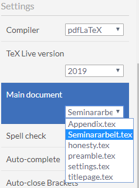

# Template für Seminararbeiten

## Nötige Anpassungen

### Persönliche Daten

In der Datei ``settings.tex`` befinden sich die wichtigsten Einstellungen, die für korrekte Erstellung der Arbeit erforderlich sind.
Bitte tragen Sie hier Ihren Namen, Matrikelnummer und Ihre E-Mail-Adresse ein -- die Informationen werden dann automatisch auf
dem Titelblatt der Arbeit und in die Eigenständigkeitserklärung übernommen.
Den Namen Ihres Betreuers und das Datum der Abgabe können Sie an der gleichen Stelle konfigurieren.

Desweiteren sollten Sie in dieser Datei prüfen, ob die Spracheinstellungen und die Art des Seminars korrekt
gesetzt sind. Die entsprechenden Einstellungsmöglichkeiten finden Sie in den Kommentaren in der Datei selbst.

### Overleaf: Projekt kompiliert nicht

Falls Sie dieses Projekt in Overleaf importieren, müssen Sie sicherstellen, dass
`Seminarabeit.tex` als *Main Document* ausgewählt ist, da LaTeX sonst mit der falschen Quelldatei versucht das Projekt zu bauen.

Dazu gehen Sie in Overleaf links oben auf *Menu* und wählen in der aufklappenden Spalte `Seminararbeit.tex` aus:

## Literaturverzeichnis

Um auf die Ihrer Arbeit zu Grunde liegenden Quellen zu verweisen, tragen Sie diese im Biblatex-Format in der
Datei ``literature.bib`` ein.

Bitte beachten Sie auch die unten stehenden Hinweise zur Erzeugung des Literaturverzeichnisses!

### LaTeX-Präambel

Falls Sie Änderungen an den geladenen LaTeX-Paketen vornehmen müssen oder zusätzlich weitere Pakete laden möchten,
finden Sie die entsprechenden Einstellungen in der Datei ``preamble.tex``.

## Literaturverwaltung

Zur Verwaltung der Referenzen verwendet die Vorlage __Biblatex__ und das Werkzeug biber (statt dem veralteten bibtex).
Möglicherweise müssen Sie in Ihrem LaTeX-Editor noch eine ensprechende Einstellung ändern.

Eine Übersicht über die nötigen Schritte finden Sie z.B. auf [StackExchange](https://tex.stackexchange.com/q/154751/2965).

Falls das fertige PDF-Dokument nach dem Kompilieren noch Referenzen der Form __[Autor99]__ enthält (wobei Autor99 der
Name der Quelle im LaTeX-Code ist, also z.B. ``\cite{Autor99}``), oder das LaTeX-Log auf fehlende Referenzen hinweist,
sollten Sie die Einstellungen Ihres Editors noch einmal überprüfen!

## Latexmk

Wenn Sie einen LaTeX-Editor mit eingebauter Projekt-Verwaltung nutzen, müssen Sie sich über den Kompilierungs-Vorgang
normalerweise keine Gedanken machen, da der Editor automatisch die benötigten Werkzeuge in der richtigen Reihenfolge aufruft.

Eine Möglichkeit, auch außerhalb eines solchen Editors in den Genuss einer automatischen Kompilierung zukommen,
bietet das Tool [Latexmk](http://mg.readthedocs.io/latexmk.html).
Dieses Werkzeug ist in allen großen LaTeX-Distributionen enthalten (insbesondere auch in MiKTeX und TeX Live für Windows).

Die Vorlage enthält bereits eine Konfigurationsdatei für Latexmk, so dass durch den folgenden Aufruf automatisch
das fertige PDF (inkl. der Literatur-Referenzen, s.o.) erstellt werden kann:

    $ latexmk -pdf Seminararbeit

Ebenso kann Latexmk die im Verlauf der Erstellung des PDF produzierten Dateien durch Angabe der Option ``-C`` wieder aufräumen:

    $ latexmk -C
